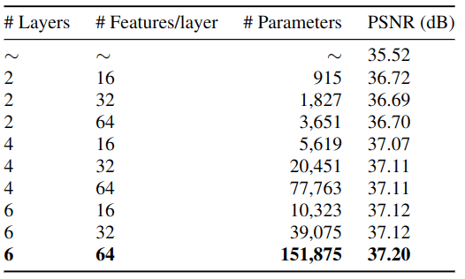
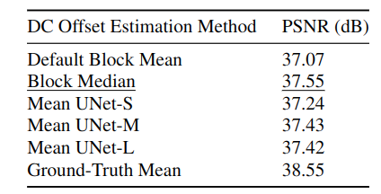

# Pushing the Limits of the Wiener Filter 
ICIP 2023 Supplementary Material

## STD Prediction-Net Diagram

  

*STD Prediction-Net Architecture and Training Pipeline. Diagram represents the 4x16 CNN variant.*

## Complete Results for all STD Prediction-Net architectures.

  

*Complete table of result for all trained STD prediction-nets, with number of trainable parameters included. The first row denotes a Wiener filter with manually input global standard deviation of $\sigma = 10$*

*Final Results for all DC-offset estimation methods. need to include params...*
## Denoising Results

